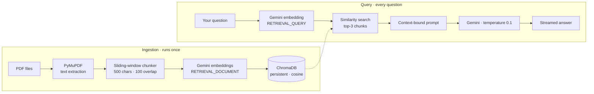

# DocQA CLI

Ask questions about your PDFs from the terminal. A retrieval-augmented generation pipeline built on **Gemini** and **ChromaDB** — grounded answers streamed token-by-token, with retry handling and structured logging underneath.


---

## What it does

Point it at a folder of PDFs. On first run it extracts, chunks, embeds, and persists them to a local vector store. After that, every question is embedded, matched against the corpus by cosine similarity, and answered **strictly from the retrieved context** — if the answer isn't in your documents, the model says so instead of inventing one.

---

## How it works



### Why the two embedding task types matter

Documents are embedded with `RETRIEVAL_DOCUMENT` and queries with `RETRIEVAL_QUERY`. Gemini optimizes these differently — using one type for both measurably degrades retrieval quality. Getting this right is the difference between a search that works and one that almost works.

---

## Features

| | Feature | Detail |
|---|---|---|
| 📄 | **PDF extraction** | PyMuPDF (`fitz`) pulls text page-by-page |
| ✂️ | **Overlapping chunks** | 500-character windows with 100-character overlap, so answers spanning a boundary aren't lost |
| 🎯 | **Asymmetric embeddings** | Separate `RETRIEVAL_DOCUMENT` / `RETRIEVAL_QUERY` task types |
| 🗄️ | **Persistent vector store** | ChromaDB with explicit cosine distance (`hnsw:space`) |
| 🧭 | **Provenance metadata** | Every chunk stores its `source` file and `index` |
| 🚫 | **Grounded answers** | Prompt instructs the model to refuse when context is insufficient |
| ⌨️ | **Streamed output** | Character-by-character rendering with natural pauses at punctuation |
| 🔁 | **Smart retries** | Exponential backoff on `429`/`5xx`; fails fast on `4xx` client errors |
| 📝 | **Structured logging** | Every embed, query, and API call written to `data/app.log` |
| ⚡ | **Idempotent startup** | Re-ingests only when the collection is empty |

---

## Error handling

Not every failure deserves a retry. The client separates them:

| Status | Class | Behaviour |
|---|---|---|
| `429`, `500`, `502`, `503`, `504` | `retryable_api_call` | Exponential backoff (2–4s), up to 2 attempts |
| `400`–`499` (other) | `non_retryable_api_call` | Fails immediately — retrying a malformed request just wastes quota |
| `ConnectionError`, `TimeoutError` | — | Retried alongside transient API errors |

---

## Getting Started

### 1. Install

```bash
git clone https://github.com/rehaannazir/DocQA-CLI.git
cd DocQA-CLI

python -m venv venv
source venv/bin/activate      # Windows: venv\Scripts\activate

pip install -r requirements.txt
```

### 2. Configure

Create a `.env` file in the project root:

```env
GEMINI_API_KEY=your-gemini-api-key
CHROMADB_PATH=./chroma_db
EMBEDDING_MODEL=gemini-embedding-001
CHAT_MODEL=gemini-2.5-flash
```

### 3. Run

```bash
cd app
python cli.py
```

Ingestion happens automatically on first launch. Then just ask:

```
Ask question(or 'exit'): What autoscaling metric does a message queue use?

A message queue typically autoscales on queue depth — the number of
unacknowledged messages waiting to be processed...

Ask question(or 'exit'): exit
```

### Re-ingesting

To rebuild the index after adding or changing documents:

```bash
python ingest.py
```

---

## Using your own documents

Drop PDFs into `docs/`, then update `DEFAULT_SOURCES` in `app/ingest.py`:

```python
DEFAULT_SOURCES = [
    "docs/your_first_document.pdf",
    "docs/your_second_document.pdf",
]
```

The repository ships with three sample documents on container orchestration, high-traffic API design, and message queues.

---

## Project structure

```
.
├── app/
│   ├── cli.py           # Interactive loop, prompt construction, streaming
│   ├── config.py        # Environment-backed configuration
│   ├── ingest.py        # Extract → chunk → embed → store
│   ├── utils.py         # PDF text extraction, sliding-window chunker
│   ├── embeddings.py    # Gemini embedding calls (document + query)
│   ├── vectorstore.py   # ChromaDB client, collection, similarity search
│   ├── llm.py           # Chat model, retry policy, error classification
│   └── log.py           # Logger configuration
├── docs/                # Source PDFs
├── data/app.log         # Runtime log output
└── requirements.txt
```

---

## Tuning

| Parameter | Location | Default |
|---|---|---|
| Chunk size | `utils.generate_chunks` | `500` characters |
| Chunk overlap | `utils.generate_chunks` | `100` characters |
| Retrieved chunks | `vectorstore.similarity_search` | `top_results=3` |
| Distance metric | `vectorstore.create_or_get_collection` | `cosine` |
| Answer temperature | `llm.generate_answer` | `0.1` |
| Retry attempts | `llm.generate_answer` | `2` |

Low temperature is deliberate — this is an extraction task, not a creative one.

---

## License

Released under the MIT License.
